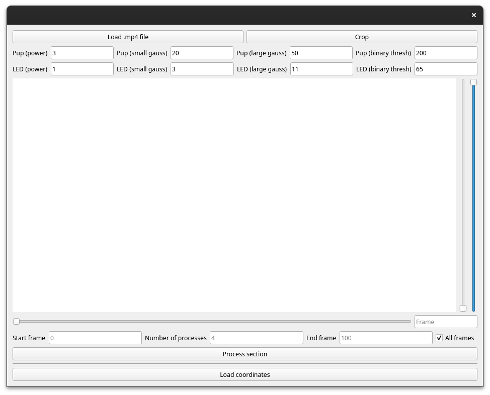

# geezer
Semi-automated pupil detection and gaze determination
     
    
1. [GUI Screenshots](#gui_example) 
2. [Installation](#installation)
3. [Usage](#usage) 

## GUI Example 

## Installation

## Usage
### 0. *(optional)* Crop original video to remove irrelevant pixels
This step will just save time during processing by reducing data on a per-frame basis:

- Click on a loaded frame at the upper-left coordinate of your desired crop, and hit the key `L` 
- Click on a loaded frame at the lower-right coordinate of your desired crop and hit the key `R` 
- The red lines will show the position of your crop 
- Push the Crop button, choose a filepath, and wait for the process to finish 
- Exit `geezer` and reload it with the cropped file 

### 1. Choosing parameters
The image is processed in parallel with two different pipelines, one for the LEDs and another for the fiducials. The results of these processes can be viewed in lieu of the raw frame. These can be switched by typing numbers from 1-5 on the keyboard.

`1` shows the original, unprocessed frame
`2` shows the difference-of-gaussians (DOG) for the pupil pipeline
`3` shows the thresholded DOG image which will be used to find the pupil centroid
`4` shows the DOG for the fiducial pipeline
`5` shows the thresholded DOG image used for finding the fiducial centroids

Roughly, the algorithm for both the pupils and the fiducials is something like:
- Exponentiate the image to the power specified in the GUI
- Filter the image with a DOG using the parameters at the top of the GUI
- Threshold
- Find the nearest continuous object in the thresholded image to the pre-determined point

* Find settings that consistently result in a single "blob" for the pupil and each of the fiducials *

### 2. Marking reference positions
- Click on an LED fiducial, then type `F`. This has now been added to the list of fiducials that `geezer` will process. Do this for all LEDs that you want to track.
- Click on the pupil at some point in the video, then type `P`

### 3. Run the algorithm
- Select the start frame, end frame, and number of processes
* For a computer with 256 cores, running with 100 processes is very efficient. Doing so on a laptop will result in the whole OS crashing. Choose wisely * 
- Hit the `Process` button and wait

